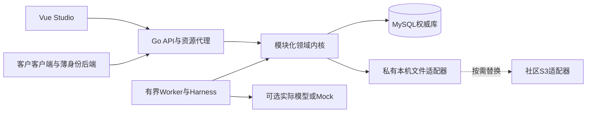

```mermaid
flowchart LR
  S[Vue Studio] --> A[Go API与资源代理]
  C[客户客户端与薄身份后端] --> A
  A --> D[模块化领域内核]
  W[有界Worker与Harness] --> D
  D --> M[(MySQL权威库)]
  D --> F[私有本机文件适配器]
  W --> P[可选实际模型或Mock]
  F -.按需替换.-> O[社区S3适配器]
```
