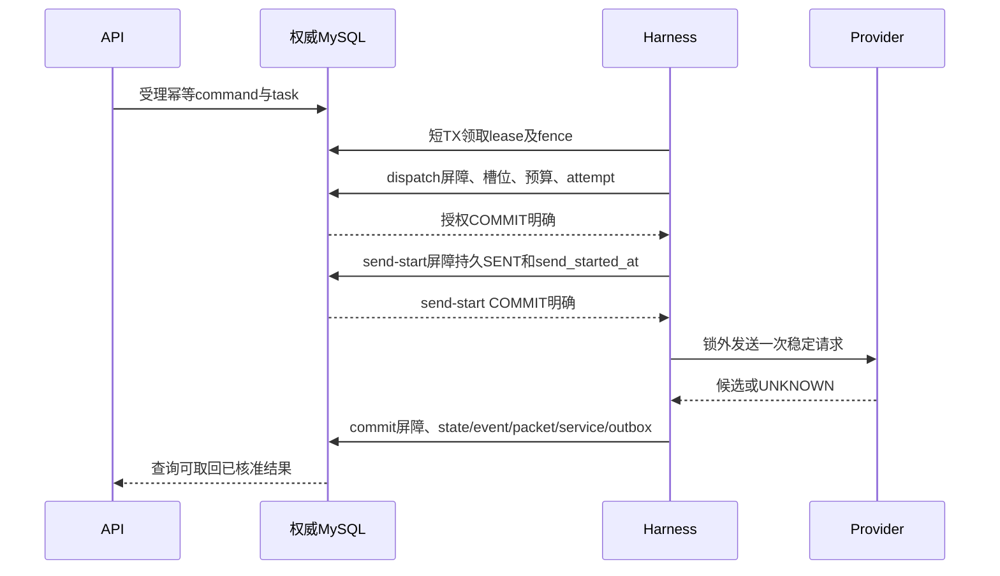

```mermaid
sequenceDiagram
  participant API
  participant DB as 权威MySQL
  participant H as Harness
  participant P as Provider
  API->>DB: 受理幂等command与task
  H->>DB: 短TX领取lease及fence
  H->>DB: dispatch屏障、槽位、预算、attempt
  DB-->>H: 授权COMMIT明确
  H->>DB: send-start屏障持久SENT和send_started_at
  DB-->>H: send-start COMMIT明确
  H->>P: 锁外发送一次稳定请求
  P-->>H: 候选或UNKNOWN
  H->>DB: commit屏障、state/event/packet/service/outbox
  DB-->>API: 查询可取回已核准结果
```
