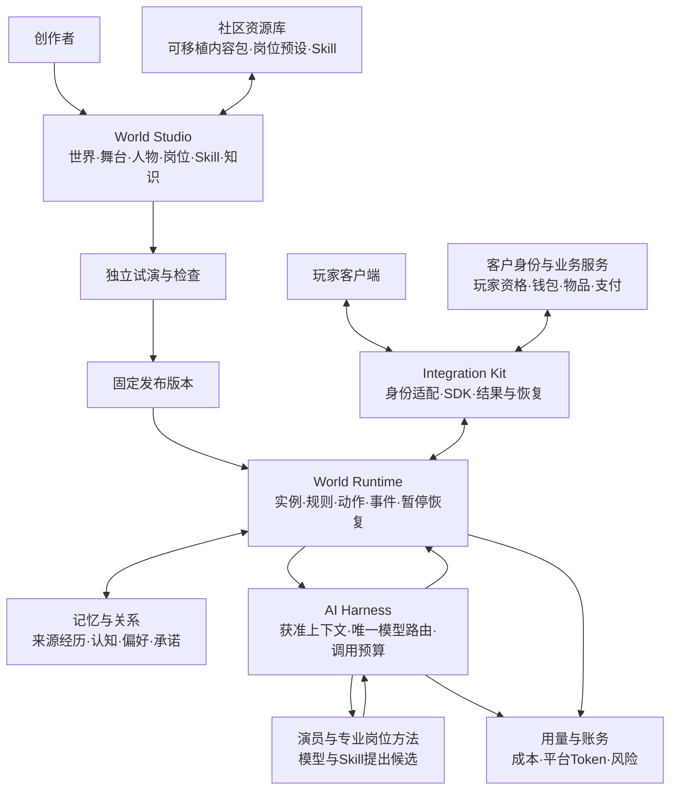

```mermaid
flowchart TB
  C[创作者] --> S[World Studio\n世界·舞台·人物·岗位·Skill·知识]
  S --> T[独立试演与检查]
  T --> V[固定发布版本]
  V --> R[World Runtime\n实例·规则·动作·事件·暂停恢复]
  P[玩家客户端] <--> K[Integration Kit\n身份适配·SDK·结果与恢复]
  K <--> R
  R <--> M[记忆与关系\n来源经历·认知·偏好·承诺]
  R --> H[AI Harness\n获准上下文·唯一模型路由·调用预算]
  H --> A[演员与专业岗位方法\n模型与Skill提出候选]
  A --> H
  H --> R
  H --> B[用量与账务\n成本·平台Token·风险]
  R --> B
  U[客户身份与业务服务\n玩家资格·钱包·物品·支付] <--> K
  L[社区资源库\n可移植内容包·岗位预设·Skill] <--> S
```
